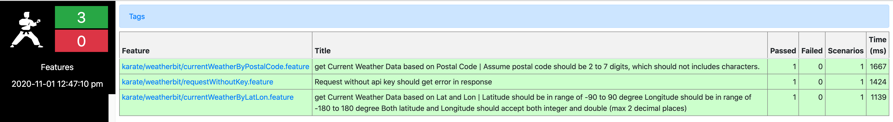

# QantasWeatherBit

This purpose of this project is to test the API of https://www.weatherbit.io/api/swaggerui/weather-api-v2#/

so far the following APIs are covered:
 - GET /current?lat={lat}&lon={lon}
 - GET /current?postal_code={postal_code}

The detail test cases, please reference to the feature files under src/test/resources/karate/weatherbit

## How to setup the project
1. Clone the project from github to your local folder (like QantasWeatherBit)
2. Config the target url and api key (Ref: How to get the key?) in karate-config.js as below
	    
	    var config = {
	        key: '9078d067619f4b098bfedaee2f40f89f',
	        testUrlBase: 'https://api.weatherbit.io/v2.0/'
	    };
    if you have multiple target environments, you can config the url with different environment names
	    
	    if (env == 'stage') {
	        // over-ride only those that need to be
	        config.testUrlBase = 'https://stage.api.weatherbit.io/v2.0/';
	    }

##How to get the api key?
1. Sign up in https://www.weatherbit.io/
2. Log in with the account you just created
3. you should be able to see the Key in the tab "API Keys/ Admin" on the dashboard

##How to run the tests in maven
Please run the command:
> mvn test

If you want to run the smoke tests only:
> mvn test "-Dkarate.options=--tags @smoke"

If you want to run the test against different environment (dev/stage):
> mvn test -Dkarate.env=dev 

## Where to get the execute report
After you run the maven test, you can find the report here:
 
 target/surefire-reports/karate-summary.html
